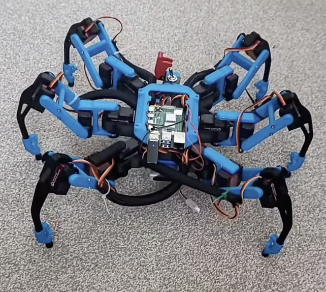
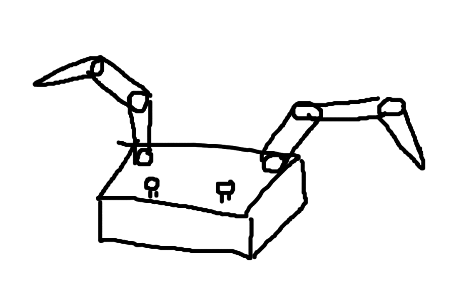

# BETC-MOTE

This is the repository containing all of the materials for Nicholas Teague's BEng Electronic Engineering project.

The project goal is to create a remote control for [BET-C](https://www.youtube.com/shorts/a6D3gN4XMFY), a 3D printed robotic hexapod.

The remote control will feature two movable appendages (see below), which are each powered and moved by three modified MG90s servos.

By default, these servos do not feature position feedback, nor current controlled positioning. This will be crucial for this project, as I would like the arms to give some feedback to the user, and be a good representation of the tele-operated limbs.

The operator should be able to set a state in the hexapod control code that allows for the joint angles of the arms on the controller to be streamed to the robot.