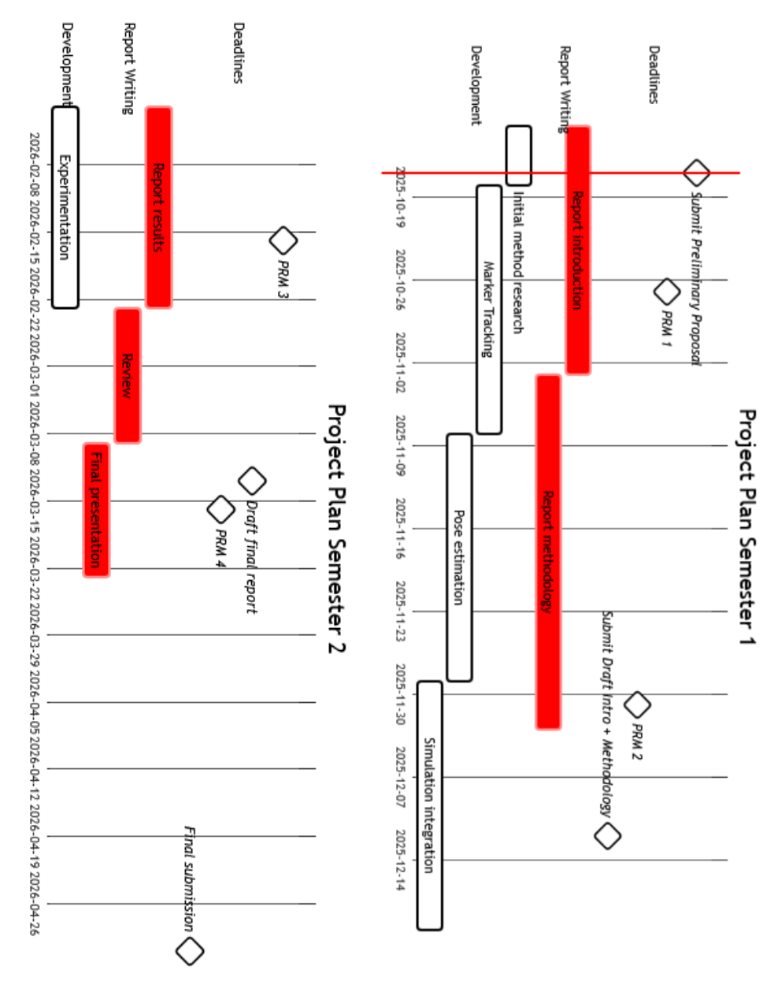

# Preliminary Project Proposal

## Overview and motivations

The goal of this project is to create a system for controlling a laterally mounted robot arm with a human arm. Ideally, the system will map each degree of freedom (DoF) of the human arm to the robot arm.

The motivation for this project are the two books: Revitalizing Human-Robot Interaction (Zhou et al) and Human Robot Awareness and Robot Teleoperation (Honghao et al), which describes research into remote teleoperation of laterally mounted robot arms. These books explain the use of an inertial measurement unit (IMU) device which maps the movement of human arms to robot arms, however they only map the end effector position to the position of the wrist.

My project would aim to create a device allowing for mapping of the full robot arm to an operator's arm. In an obstacle-rich environment, mapping of the end effector position is insufficient. The main advantage of teleoperation is to allow the human operator to make real time judgments for complex situations, and thus fully mapping out the operator's intentions to the robot is crucial.

One such scenario that is researched is given in the paper by Jin et al, describing a complex obstacle avoidance algorithm for moving a robot arm underwater for sample retrieval. The drawback mentioned in this paper is that both the sample and arm origin is stationary, and the algorithm takes up to ten seconds to solve this simple case. Ostensibly, one can imagine the complexity required for a scenario where both the sample, arm, and obstacles are moving - solving this autonomously is inefficient compared to using human intuition.

## Deliverables

The deliverables for this project are as follows:

- The creation of a device or software that is capable of reading the angles in an operator's arm, in real time.
  - Part of the project scope will be the rigorous examination of existing methods, and justifying the chosen method.
- Applying the values read in from this software to a simulation environment, where a laterally mounted 7 DoF robot arm is controlled from the operator's arm movements.
- Creating an obstacle-rich simulation, where an operator is tasked with moving between points to quantify the differences in success criteria over conventional control methods (e.g. a joystick or traditional end effector mapping).
- Creation of a final report that outlines a table of contents, introduction, methodology, results and conclusion.

## Risk Mitigation

The biggest risk on this project is scope creep, and the potential for the project to be more complicated than first imagined. This is why the plan is structured with lots of contingency built in, and structured incrementally. Each deliverable is a significant milestone which lays the foundation for the next, meaning that at every stage there should be sufficient work completed to create a meaningful report.

## Timeline

