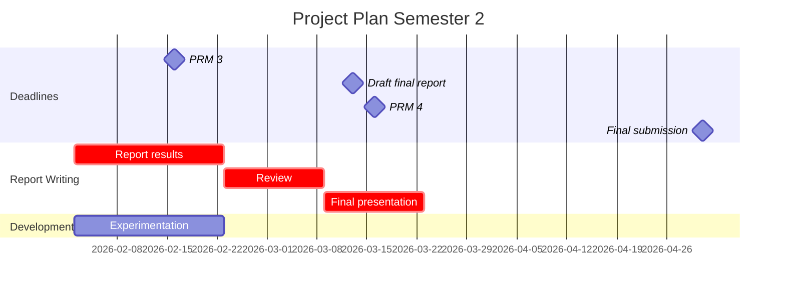

```mermaid
gantt
    title Project Plan Semester 1
    section Deadlines
      Submit Preliminary Proposal : milestone, 2025-10-17,
      PRM 1 : milestone, 2025-10-27,
      PRM 2 : milestone, 2025-12-01,
      Submit Draft Intro + Methodology : milestone,SUBMITDEADLINE, 2025-12-12,
    section Report Writing
      Report introduction  :crit,INTRO, 2025-10-13, 21d
      Report methodology: crit, after INTRO, 30d
    section Development
      Initial method research     : 2025-10-13, 5d
      Pose Estimation: 2025-10-18, 21d
      Marker Tracking   : 2025-11-08, 21d
      Simulation integration : 2025-11-29, 21d
```

```mermaid
gantt
    section Deadlines
      PRM 3: milestone, 2026-02-16,
      Draft final report : milestone, 2026-03-13,
      PRM 4: milestone, 2026-03-16,
      Final submission: milestone, 2026-05-01, 
    section Report Writing
      title Project Plan Semester 2
      Report results  :crit, 2026-02-02, 21d
      Review :crit, 2026-02-23, 14d
      Final presentation: crit, 2026-03-09, 14d
    section Development
      Experimentation: 2026-02-02, 21d

```
