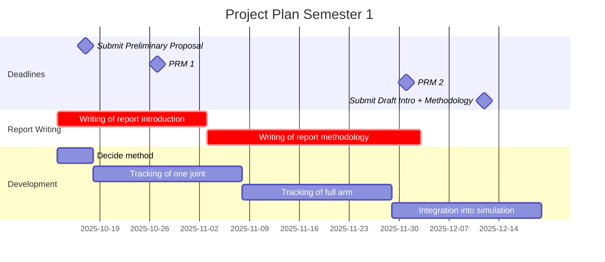
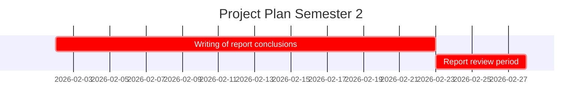

```mermaid
gantt
    title Project Plan Semester 1
    section Deadlines
      Submit Preliminary Proposal : milestone, 2025-10-17,
      PRM 1 : milestone, 2025-10-27,
      PRM 2 : milestone, 2025-12-01,
      Submit Draft Intro + Methodology : milestone,SUBMITDEADLINE, 2025-12-12,
    section Report Writing
      Writing of report introduction  :crit,INTRO, 2025-10-13, 21d
      Writing of report methodology: crit, after INTRO, 30d
    section Development
      Decide method     : 2025-10-13, 5d
      Tracking of one joint: 2025-10-18, 21d
      Tracking of full arm   : 2025-11-08, 21d
      Integration into simulation : 2025-11-29, 21d
```

```mermaid
gantt
    title Project Plan Semester 2
    Writing of report conclusions  :crit, 2026-02-02, 21d
    Report review period :crit, 2026-02-23, 5d

```
