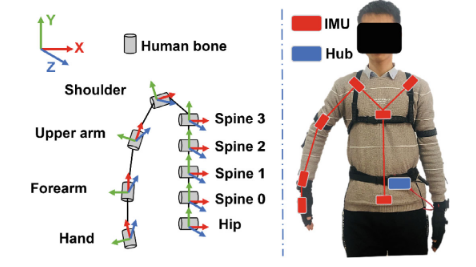

30/09/25

- Set up repo

01/10/25

- Read [Revitalizing Human-Robot Interaction](https://link-springer-com.manchester.idm.oclc.org/book/10.1007/978-981-96-6139-8) (Zhou, Yang, Wang, Dong)
  - This book explains the creation of a method to teleoperate robot arms, and successfully demonstrate it with an operator in Sweden manipulating robot arms in China.
  - They create an IMU based tracking device to measure the joint angles of a human operators arms, and then map them to movements in the real world with robot arms.
  - A key drawback of this is that they mention their IMU based system doesn't account for the complex motion mapping of the human arm to the robot arm, only the end effector pose to the wrist.
  - Kalman filter algorithm + specific calibration poses to create relationship between sensor coordinate system and real world

02/10/25

- Read [this](https://link-springer-com.manchester.idm.oclc.org/book/10.1007/978-1-84882-474-4) for context on rubble robot searching
- Read [this](https://research.manchester.ac.uk/en/publications/receding-horizon-contact-planning-for-advanced-motions-in-hexapod/fingerprints/)

06/10/25

- Read [Human Robot Awareness and Robot Teleoperation](https://link-springer-com.manchester.idm.oclc.org/book/10.1007/978-981-96-6545-7)
  - One such application for robot teleoperation is in the healthcare industry, where one worker can control multiple robots, acting as a 'second body' for healthcare workers. This prevents them from getting sick from the patient they are treating, etc.
  - Another advantage is that the human hand is a lot more accurate in tracking operator intentions than conventional methods of operation, i.e. joysticks or controllers.
  - Single vs dual arm - most hospital applications require dual arm control whereas most conventional interfaces only focus on single arm pose mapping.
  - Network communication - latency is a key driver in design decisions for teleoperation.
  - 