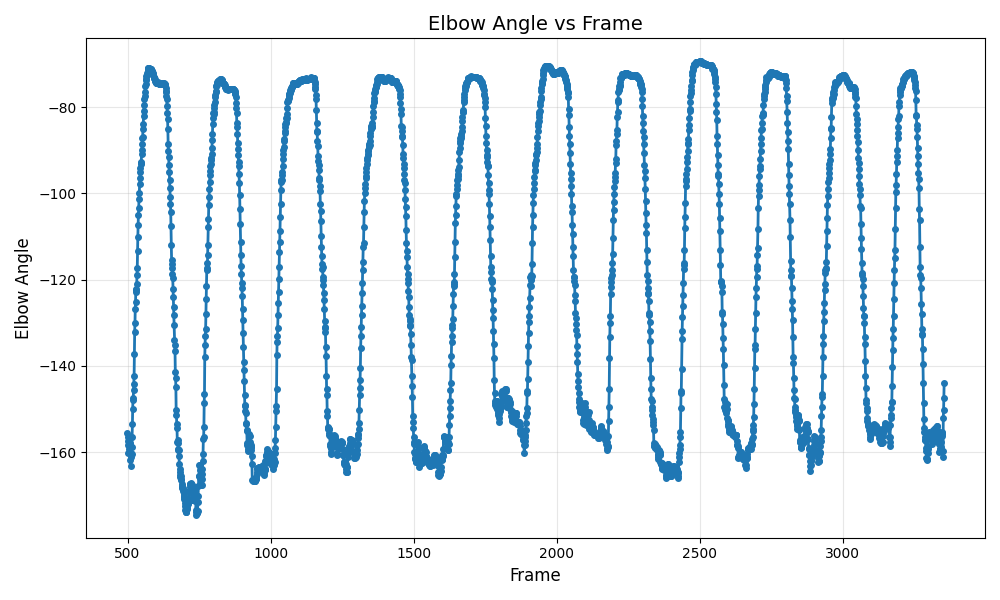

30/09/25

- Set up repo

01/10/25

- Read [Revitalizing Human-Robot Interaction](https://link-springer-com.manchester.idm.oclc.org/book/10.1007/978-981-96-6139-8) (Zhou, Yang, Wang, Dong)
  - This book explains the creation of a method to teleoperate robot arms, and successfully demonstrate it with an operator in Sweden manipulating robot arms in China.
  - They create an IMU based tracking device to measure the joint angles of a human operators arms, and then map them to movements in the real world with robot arms.
  - A key drawback of this is that they mention their IMU based system doesn't account for the complex motion mapping of the human arm to the robot arm, only the end effector pose to the wrist.
  - Kalman filter algorithm + specific calibration poses to create relationship between sensor coordinate system and real world

02/10/25

- Read [this](https://link-springer-com.manchester.idm.oclc.org/book/10.1007/978-1-84882-474-4) for context on rubble robot searching
- Read [this](https://research.manchester.ac.uk/en/publications/receding-horizon-contact-planning-for-advanced-motions-in-hexapod/fingerprints/)

06/10/25

- Read [Human Robot Awareness and Robot Teleoperation](https://link-springer-com.manchester.idm.oclc.org/book/10.1007/978-981-96-6545-7)
  - One such application for robot teleoperation is in the healthcare industry, where one worker can control multiple robots, acting as a 'second body' for healthcare workers. This prevents them from getting sick from the patient they are treating, etc.
  - Another advantage is that the human hand is a lot more accurate in tracking operator intentions than conventional methods of operation, i.e. joysticks or controllers.
  - Single vs dual arm - most hospital applications require dual arm control whereas most conventional interfaces only focus on single arm pose mapping.
  - Network communication - latency is a key driver in design decisions for teleoperation.
  - 
  - They specifically focus ONLY on end effector mapping, disregarding the joint 

08/10/25

- Read [An Effective Obstacle Avoidance and Motion Planning Design for Underwater Telescopic Arm Robots Based on a Tent Chaotic Dung Beetle Algorithm](https://www.librarysearch.manchester.ac.uk/discovery/fulldisplay?docid=cdi_proquest_journals_2876395724&context=PC&vid=44MAN_INST:MU_NUI&lang=en&search_scope=MyInst_and_CI&adaptor=Primo%20Central&tab=Everything&query=any,contains,robot%20arm%20obstacle%20avoidance&sortby=rank&mode=basic&offset=10&pcAvailability=false)
  - Key limitation: they mention marine sample capture, but limit it only to predetermined starting and ending positions, and that the environment around it is static.
  - This reveals a gap for where human teleoperation could be beneficial - in the real world where visual feedback + trained operators could use a set up like in Lyu et al with the dual arm IMU sensor to control the arm.

10/10/25

- Started work on proposal document

13/10/25

- Pugh Matrix (Bigger number = better):

|Tracking Method|Complexity (1-5)|Cost (1-5)|Accuracy (1-5)|Latency (1-5)| Comments | Examples / sources | Total |
|--|--|--|--|--|--|--|--|
|IMU fusion|2|3|3|5|Sensor drift mitigation and data fusion will add complexity, and possibly latency.| [Honghao et al](https://link-springer-com.manchester.idm.oclc.org/book/10.1007/978-981-96-6545-7), [Zhou et al](https://link-springer-com.manchester.idm.oclc.org/book/10.1007/978-981-96-6139-8), [Masters et al](https://pmc.ncbi.nlm.nih.gov/articles/PMC8142556/pdf/nihms-1702711.pdf)|13/20|
|Strain Gauge|3|2|2|4|Strain gauges are cheap, but will need one for every degree of freedom. Complexity could arise from tracking shoulder rotation.| [Araromi et al](https://www.librarysearch.manchester.ac.uk/permalink/44MAN_INST/1rfd42k/cdi_proquest_miscellaneous_2460081548) |11/20|
|Pose estimation (Computer Vision)|3|5|3|3|Open source implementations already available for preliminary analysis. Little to no cost, and development can be done 24/7 as no access to hardware is required.| [Brauer](https://www.librarysearch.manchester.ac.uk/permalink/44MAN_INST/bofker/alma992991560133101631)|14/20|
|Marker/Fiducial tracking (Computer Vision)|3|4|4|3|Very similar advantages to pose estimation, although this introduces the additional aspects of having to source markers.|[Kado et al](https://www.librarysearch.manchester.ac.uk/permalink/44MAN_INST/1rfd42k/cdi_crossref_primary_10_3130_aijt_27_1092), [Timmi et al](https://www.librarysearch.manchester.ac.uk/permalink/44MAN_INST/1rfd42k/cdi_webofscience_primary_000453645400010CitationCount) |14/20|
|Exoskeleton tracker|1|2|4|4|Would have to source or build a tracking rig, which would add too much to project scope. Latency and accuracy advantages are outweighed by complexity to develop and hardware costs.| [Zimmerman et al](https://www.librarysearch.manchester.ac.uk/permalink/44MAN_INST/1rfd42k/cdi_webofscience_primary_000724145801125CitationCount) | 11/20|
|Flex sensors|3|4|2|4|Similar to strain gauges, but these can be sewn into garments without the need to build additional hardware. | [Rashid](https://www.librarysearch.manchester.ac.uk/permalink/44MAN_INST/1rfd42k/cdi_proquest_journals_2760225437) |13/20|

- Add columns for DoF
- better explanation of columnstitles

14/10/25

- Created basic computer vision tracking script for fun

16/10/25

- Finished proposal document and planning
- Finished project risks

21/10/25

- Extended [this](https://github.com/sudeepksharma/Human-Pose-Estimation-using-Opencv) gitrepo to calculate 3d joint vectors from mediapipe's 3D joint position data
  - Playing around with various ways of calculation joints, including using 2D angle data, projecting onto the plane of the chest / hip angles.
- Designing a hypothetical experiment for measuring the 'accuracy' of the joint tracking method.

# Joint tracking experiment

- The goal: compare accuracy between two methods of computer vision joint tracking.

30/10/25

- Working on introduction
- Gathered preliminary data for pose tracking
- Creating programs for plotting and processing data (for later scaling)
- Still on track with schedule

- 

- PRM Talking points
  - What skills do I need to learn?
    - aruco marker tracking with opencv
      - I've already got a method for inferring joint angles when XYZ of joint positions are known, if we can figure out how to obtain this data from the marker tracking then we'll be good
    - CoppeliaSim
      - Robot simulation stuff
      - URDF manipulation (for getting correct robot behaviour + dimensions)
  - 